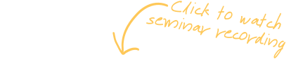

<!--  -->

<!--  -->

### Expert of the month
<orange>Agâh Karakuzu  Postdoctoral researcher at NeuroPoly Lab, Polytechnique Montreal</orange>

Agâh is a postdoctoral researcher at NeuroPoly Lab, Polytechnique Montreal, where he recently obtained his Ph.D. on end-to-end standardization of quantitative MRI methods through the development of vendor-neutral pulse sequences (VENUS), community data standards (qMRI-BIDS), and open-source post-processing workflows (qMRLab). To extend the scope of transparency from scanner to publication, he is leading the development of NeuroLibre, a preprint server for reproducible neuroscience notebooks.

He is an active contributor to several open-source neuroimaging initiatives (BrainHack, MRathon, Open MR, MRI Together, OHBM OSR), as well as to science communication/publication platforms (MRM Highlights, OHBM Blog, and ISMRM MR Pulse, MRPub).

### Seminar/Workshop

<orange>When</orange>
Tuesday, September 17, 2024 at 12 pm

<orange>Where</orange>
de Grandpre Communications Centre, the Neuro (Montreal Neurological Institute-Hospital)

And on Zoom (register for link)

<orange>Abstract</orange>
The needs of scientific publishing have evolved with the increasing computational complexity behind research articles. Just as authoring tools advanced from typewriters to text editors, it’s time to integrate computation into publications. NeuroLibre is designed for this purpose, enabling reproducible preprints. In this workshop, we'll explore how to prepare and submit a NeuroLibre preprint, familiarizing ourselves with next-generation authoring tools.

<orange>Attendance is FREE, please register:</orange> 
**[Here!](https://forms.gle/9TMWWF2DgZ4tCqfNA)**
