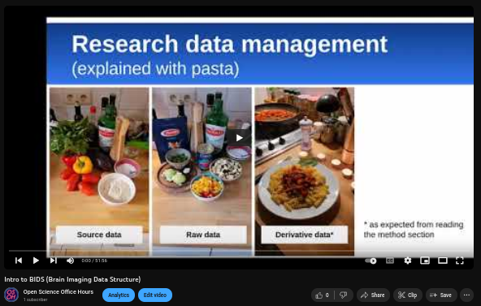

<!--  -->

<!--  -->

**Please note that today's event has been canceled due to unexpected circumstances.
Thank you to everyone who registered to attend and we apologize for any inconvenience this may have caused you.
Stay tuned for the next OSOH event in December!**

### Expert of the month
<orange>Robin Desmeules Interim Coordinator of Scholarly Communications at McGill Libraries</orange>

Robin Desmeules is a Cataloguing Librarian at McGill University, and works with rare and special materials. She has been a librarian since 2014 with a commitment to Open Scholarship. Her work focuses on critical approaches to knowledge organization, experimenting and implementing linked data for special collections, and community generated naming systems.
### Seminar/Workshop
**Please note that today's event has been canceled due to unexpected circumstances.
Thank you to everyone who registered to attend and we apologize for any inconvenience this may have caused you.
Stay tuned for the next OSOH event in December!**

<orange>When</orange>
Tuesday, November 12, 2024 at 4 pm

<orange>Where</orange>
Thomson House Room 405, PGSS McGill University - 3650 McTavish, Montreal, Quebec (Limited spots for in-person attendance!)

And on Zoom (register for link)

<orange>Abstract</orange>
In this session, you will explore how to ensure that your published work is made openly accessible, prioritizing access over profit. We will dive into why making your work open matters, not just for your own visibility and impact, but also to advance knowledge-sharing globally. You will learn how to navigate the open publishing landscape in Canada, including key insights on current and upcoming funding agencies requirements for open access publishing. This workshop will focus on the importance of open science, with open access at its heart. You’ll discover how adopting open publishing practices is taking a bite out of the for-profit publishing model, helping democratize research. Open publishing is key to ensuring that research findings are shared widely, equitably, and without the barriers imposed by traditional publishing houses. Join us to learn practical steps for making your work accessible to all.

<orange>Attendance is FREE, please register:</orange> 
**[Here!](https://shorturl.at/ewdQp)**
