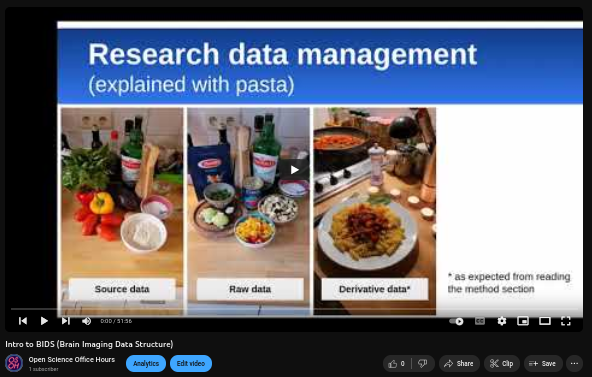

<!--  -->

<!--  -->

### Expert of the month
<orange>Joyce Li  3rd year medical student, McGill Faculty of Medicine and Health Sciences</orange>

Joyce is a third-year medical student at McGill who discovered her love for the Brain during her Neurology block in medical school. Her research interest lies in scientific education, and her project aims to promote awareness around white matter diseases as well as to give prospective students the image skills necessary to interpret them on MRI.
In her free time, Joyce enjoys writing fiction, running around the canal, painting and sharing recipes with friends! She also spends a lot of time losing at Mario Kart, though that’s less enjoyable.

### Seminar/Workshop

<orange>When</orange>
Wednesday, April 30, 2025 at 3:30 pm EST

<orange>Where</orange>
de Grandpré Communications Centre, the Neuro (Montreal Neurological Institute-Hospital)
**Click [here] for directions (https://www.mcgill.ca/neuro/about/find-us/wayfinding)**
And on Zoom (register for link)

<orange>Abstract</orange>
In the past two decades, neuroimaging has become central to neuroscience research and clinical work. However, in a recent survey we developed, many neuroscience graduate and medical students at our University reported receiving little to no formal neuroimaging training in their curriculum. Launched by students of the La Piana lab, the overarching goal of BIE is to create open opportunities for students to be introduced to the basics of brain MRI, within and beyond the Neuro community. The target audience is any student with an interest in brain MR images with no previous training in this area, regardless of where they are in the world.

<orange>Attendance is FREE, please register:</orange> 
**[Here!](https://www.eventbrite.com/e/open-science-office-hours-special-lecture-tickets-1123667452599?aff=ebdsshcopyurl&utm-campaign=social&utm-content=attendeeshare&utm-medium=discovery&utm-term=listing&utm-source=cp)**

<orange>Book a one-on-one with our expert of the month:</orange> 
**[Here!](https://calendly.com/open-science-expert)**

